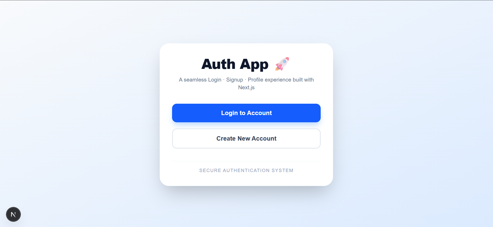
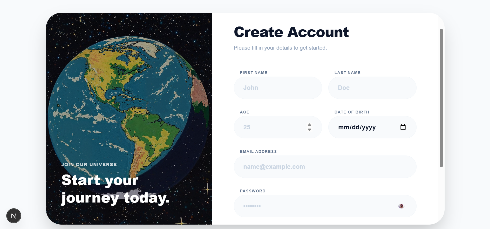
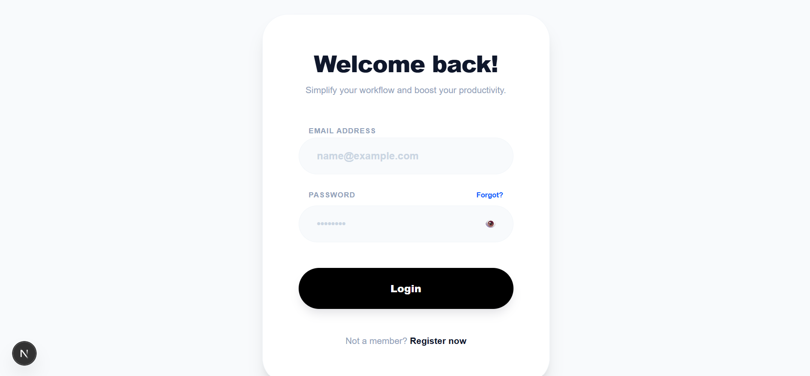
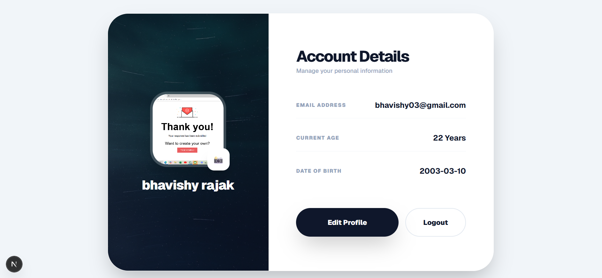

# Next Auth Profile App 🔐👤

A simple authentication-based web application built using **Next.js (App Router)** that demonstrates a complete **Signup, Login, and Profile management flow** with protected routes.

This project is created for **learning purposes and interview demonstration**.

---

## 🚀 Features

- User Signup
- User Login (Mock Authentication)
- Protected Profile Page
- Client-side authentication using `localStorage`
- Profile image upload (Base64 format)
- Edit profile details
- Logout functionality
- Clean and simple UI

---

## 🛠️ Tech Stack

- **Next.js 16 (App Router)**
- **React**
- **JavaScript / TypeScript**
- **CSS**
- **Lucide Icons**
- **Git & GitHub**

---

## 📂 Project Structure
```
app/
├─ page.js # Home page (Login / Signup entry)
├─ login/page.tsx # Login page
├─ signup/page.tsx # Signup page
├─ profile/page.tsx # Protected profile page
├─ api/
│ ├─ login/route.ts # Mock login API
│ └─ signup/route.ts # Mock signup API
public/
└─ images/
screenshots/
├─ home.png
├─ signup.png
├─ login.png
└─ profile.png
```

---

## 🔐 Authentication Flow (How it Works)

1. User signs up → user data is stored in `localStorage`
2. User logs in → credentials are validated on the client side
3. A mock token is generated and saved in `localStorage`
4. Profile page checks for token → allows or blocks access
5. User profile data and image persist across page refresh
6. Logout clears `localStorage` and redirects to login

 ⚠️ This is a **mock authentication system**.  
 In real-world applications, authentication is handled securely on the backend.

---

## 🖼️ Screenshots

### Home Page


### Signup Page


### Login Page


### Profile Page


---

## ▶️ Getting Started

### 1. Clone the repository
```bash
git clone https://github.com/bhavishy03/next-auth-profile.git

```
### 2 Navigate to project folder
```bash
cd next-auth-profile
```

## 3 cd next-auth-profile
```bash
npm install
```

## 4 Run the development server
```bash
Run the development server
```

## 5 Open your browser and visit
```bash
Open your browser and visit
```
